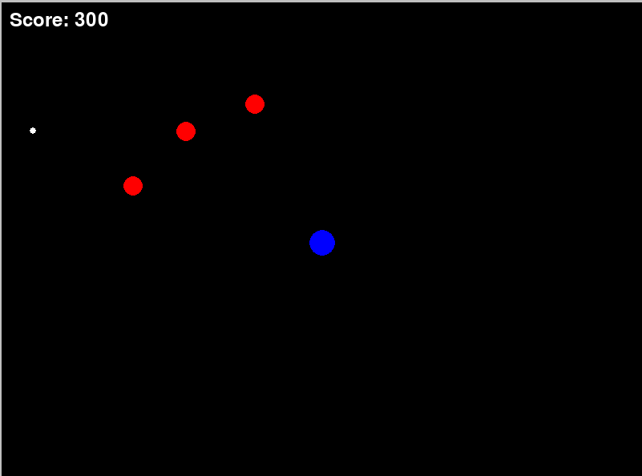
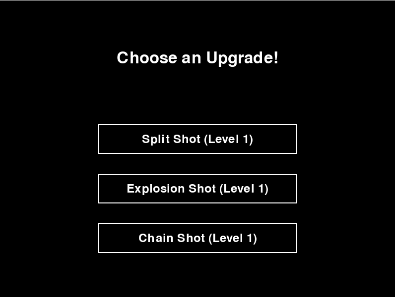

# Dot Survivor

A minimalist survival game inspired by Vampire Survivors, built with Pygame.

## Description

Dot Survivor is a simple 2D survival game where you control a blue dot trying to survive waves of red enemy dots. The game features:

- Top-down shooter gameplay
- Automatic camera zoom as the world expands
- Multiple upgrade paths:
  - Split Shot: Fire additional projectiles in a spread pattern
  - Chain Shot: Projectiles chain between enemies
  - Explosion Shot: Projectiles create explosions on impact

## Controls

- WASD: Move player
- Mouse: Aim
- Left Click: Shoot
- Upgrades appear every 500 points
